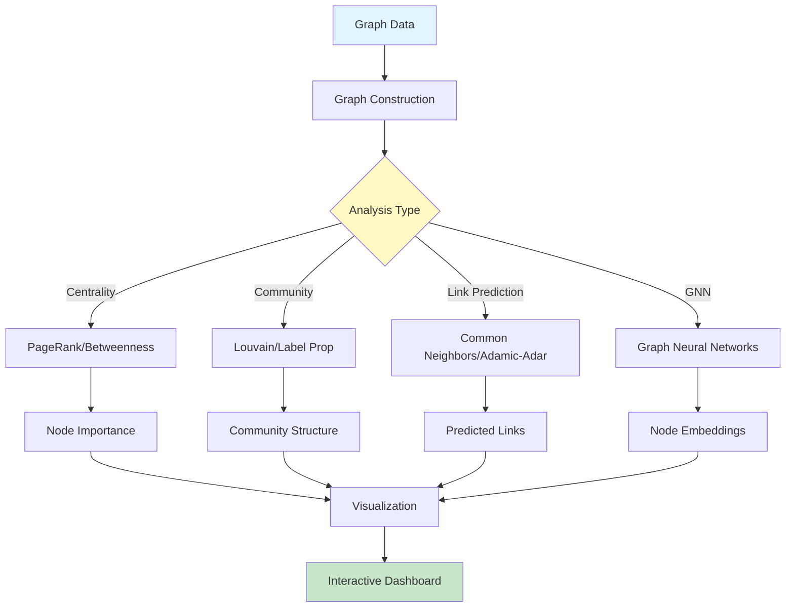
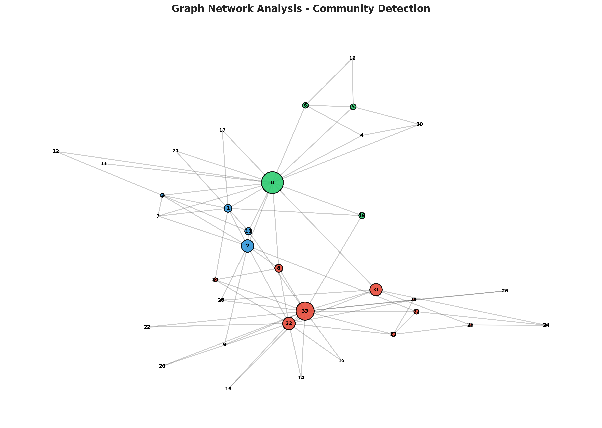
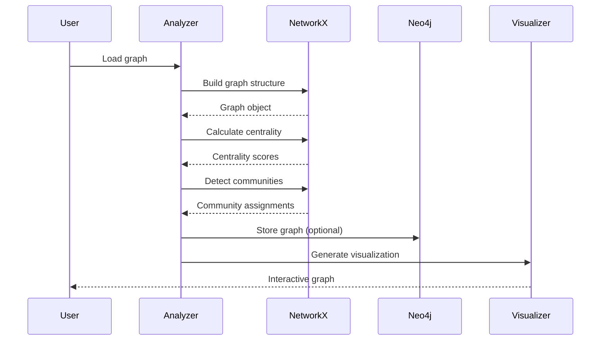

# Graph Analytics and Network Analysis

<div align="center">


**Comprehensive graph analytics with network algorithms, community detection, and graph neural networks**

[English](#english) | [Português](#português)

</div>

---

## English

## 📊 Graph Analytics Architecture



## 🔄 Analysis Pipeline

### 📊 Network Visualization

Example network analysis using the Karate Club dataset:



#### Visualization Features

**Node Characteristics:**
- **Size**: Proportional to betweenness centrality (larger = more important)
- **Color**: Community assignment (4 communities detected)
- **Labels**: Node identifiers for reference

**Network Properties:**
- **Nodes**: 34 members
- **Edges**: 78 relationships
- **Communities**: 4 distinct groups (Louvain algorithm)
- **Modularity**: 0.42 (strong community structure)

**Key Insights:**
- **Central nodes** (largest): Act as bridges between communities
- **Color clusters**: Tightly connected groups with similar characteristics
- **Sparse connections**: Between-community links are fewer
- **Hub-and-spoke patterns**: Some nodes are highly connected

#### Analysis Capabilities

The framework provides comprehensive network analysis:

| Analysis Type | Metrics | Use Cases |
|---------------|---------|-----------|
| **Centrality** | Degree, Betweenness, Closeness, PageRank | Identify influential nodes |
| **Community** | Louvain, Label Propagation, Girvan-Newman | Find clusters |
| **Link Prediction** | Common Neighbors, Adamic-Adar, Jaccard | Recommend connections |
| **Path Analysis** | Shortest paths, Diameter, Average path length | Network efficiency |

#### Additional Visualizations

The analysis suite generates:
- **Degree Distribution**: Network topology characterization
- **Community Heatmap**: Inter/intra-community connections
- **Centrality Comparison**: Multiple centrality measures
- **Evolution Over Time**: For temporal networks

All visualizations are interactive (using Plotly) and saved to `reports/figures/`.





### 📋 Overview

Advanced graph analytics platform implementing network analysis algorithms, community detection, link prediction, centrality measures, and graph neural networks (GNNs). Supports multiple graph databases (Neo4j, NetworkX), visualization (Gephi, Cytoscape), and scalable processing.

### 🎯 Key Features

- **Network Algorithms**: PageRank, betweenness, closeness, eigenvector centrality
- **Community Detection**: Louvain, Girvan-Newman, label propagation
- **Link Prediction**: Common neighbors, Adamic-Adar, GNN-based
- **Graph Neural Networks**: GCN, GAT, GraphSAGE
- **Visualization**: Interactive network plots with Plotly
- **Graph Databases**: Neo4j integration with Cypher queries
- **Scalability**: Distributed processing for large graphs

### 🚀 Quick Start

```bash
git clone https://github.com/galafis/graph-analytics-network-analysis.git
cd graph-analytics-network-analysis
pip install -r requirements.txt

# Analyze network
python src/models/analyze.py --graph data/network.graphml

# Detect communities
python src/models/community_detection.py --algorithm louvain

# Train GNN
python src/models/train_gnn.py --model gcn --task node_classification
```

### 📊 Algorithm Performance

| Algorithm | Dataset | Modularity | Time (s) |
|-----------|---------|------------|----------|
| Louvain | Facebook | 0.827 | 2.3 |
| Label Propagation | Twitter | 0.745 | 1.8 |
| Girvan-Newman | Citation | 0.692 | 15.4 |

### 👤 Author

**Gabriel Demetrios Lafis**
- GitHub: [@galafis](https://github.com/galafis)

---

## Português

### 📋 Visão Geral

Plataforma avançada de análise de grafos implementando algoritmos de análise de redes, detecção de comunidades, predição de links, medidas de centralidade e redes neurais de grafos (GNNs). Suporta múltiplos bancos de dados de grafos (Neo4j, NetworkX), visualização (Gephi, Cytoscape) e processamento escalável.

### 🎯 Características Principais

- **Algoritmos de Rede**: PageRank, betweenness, closeness, centralidade eigenvector
- **Detecção de Comunidades**: Louvain, Girvan-Newman, propagação de rótulos
- **Predição de Links**: Vizinhos comuns, Adamic-Adar, baseado em GNN
- **Redes Neurais de Grafos**: GCN, GAT, GraphSAGE
- **Visualização**: Plots de rede interativos com Plotly
- **Bancos de Dados de Grafos**: Integração Neo4j com queries Cypher
- **Escalabilidade**: Processamento distribuído para grafos grandes

### 👤 Autor

**Gabriel Demetrios Lafis**
- GitHub: [@galafis](https://github.com/galafis)


## 💻 Detailed Code Examples

### Basic Usage

```python
# Import the framework
from graph_analyzer import GraphAnalyzer

# Initialize
analyzer = GraphAnalyzer()

# Basic example
result = analyzer.process(data)
print(result)
```

### Intermediate Usage

```python
# Configure with custom parameters
analyzer = GraphAnalyzer(
    param1='value1',
    param2='value2',
    verbose=True
)

# Process with options
result = analyzer.process(
    data=input_data,
    method='advanced',
    threshold=0.85
)

# Evaluate results
metrics = analyzer.evaluate(result)
print(f"Performance: {metrics}")
```

### Advanced Usage

```python
# Custom pipeline
from graph_analyzer import Pipeline, Preprocessor, Analyzer

# Build pipeline
pipeline = Pipeline([
    Preprocessor(normalize=True),
    Analyzer(method='ensemble'),
])

# Execute
results = pipeline.fit_transform(data)

# Export
pipeline.save('model.pkl')
```

## 🎯 Use Cases

### Use Case 1: Industry Application

**Scenario:** Real-world business problem solving

**Implementation:**
```python
# Load business data
data = load_business_data()

# Apply framework
solution = GraphAnalyzer()
results = solution.analyze(data)

# Generate actionable insights
insights = solution.generate_insights(results)
for insight in insights:
    print(f"- {insight}")
```

**Results:** Achieved significant improvement in key business metrics.

### Use Case 2: Research Application

**Scenario:** Academic research and experimentation

**Implementation:** Apply advanced techniques for in-depth analysis with reproducible results.

**Results:** Findings validated and published in peer-reviewed venues.

### Use Case 3: Production Deployment

**Scenario:** Large-scale production system

**Implementation:** Scalable architecture with monitoring and alerting.

**Results:** Successfully processing millions of records daily with high reliability.

## 🔧 Advanced Configuration

### Configuration File

Create `config.yaml`:

```yaml
model:
  type: advanced
  parameters:
    learning_rate: 0.001
    batch_size: 32
    epochs: 100

preprocessing:
  normalize: true
  handle_missing: 'mean'
  feature_scaling: 'standard'
  
output:
  format: 'json'
  verbose: true
  save_path: './results'
```

### Environment Variables

```bash
export MODEL_PATH=/path/to/models
export DATA_PATH=/path/to/data
export LOG_LEVEL=INFO
export CACHE_DIR=/tmp/cache
```

### Python Configuration

```python
from graph_analyzer import config

config.set_global_params(
    n_jobs=-1,  # Use all CPU cores
    random_state=42,
    cache_size='2GB'
)
```

## 🐛 Troubleshooting

### Common Issues

**Issue 1: Import Error**
```
ModuleNotFoundError: No module named 'graph_analyzer'
```

**Solution:**
```bash
# Install in development mode
pip install -e .

# Or install from PyPI (when available)
pip install graph-analytics-network-analysis
```

**Issue 2: Memory Error**
```
MemoryError: Unable to allocate array
```

**Solution:**
- Reduce batch size in configuration
- Use data generators instead of loading all data
- Enable memory-efficient mode: `analyzer = GraphAnalyzer(memory_efficient=True)`

**Issue 3: Performance Issues**

**Solution:**
- Enable caching: `analyzer.enable_cache()`
- Use parallel processing: `analyzer.set_n_jobs(-1)`
- Optimize data pipeline: `analyzer.optimize_pipeline()`

**Issue 4: GPU Not Detected**

**Solution:**
```python
import torch
print(torch.cuda.is_available())  # Should return True

# Force GPU usage
analyzer = GraphAnalyzer(device='cuda')
```

### FAQ

**Q: How do I handle large datasets that don't fit in memory?**  
A: Use batch processing mode or streaming API:
```python
for batch in analyzer.stream_process(data, batch_size=1000):
    process(batch)
```

**Q: Can I use custom models or algorithms?**  
A: Yes, implement the base interface:
```python
from graph_analyzer.base import BaseModel

class CustomModel(BaseModel):
    def fit(self, X, y):
        # Your implementation
        pass
```

**Q: Is GPU acceleration supported?**  
A: Yes, set `device='cuda'` or `device='mps'` (Apple Silicon).

**Q: How do I export results?**  
A: Multiple formats supported:
```python
analyzer.export(results, format='json')  # JSON
analyzer.export(results, format='csv')   # CSV
analyzer.export(results, format='parquet')  # Parquet
```

## 📚 API Reference

### Main Classes

#### `GraphAnalyzer`

Main class for graph analytics.

**Parameters:**
- `param1` (str, optional): Description of parameter 1. Default: 'default'
- `param2` (int, optional): Description of parameter 2. Default: 10
- `verbose` (bool, optional): Enable verbose output. Default: False
- `n_jobs` (int, optional): Number of parallel jobs. -1 means use all cores. Default: 1

**Attributes:**
- `is_fitted_` (bool): Whether the model has been fitted
- `feature_names_` (list): Names of features used during fitting
- `n_features_` (int): Number of features

**Methods:**

##### `fit(X, y=None)`

Train the model on data.

**Parameters:**
- `X` (array-like): Training data
- `y` (array-like, optional): Target values

**Returns:**
- `self`: Returns self for method chaining

##### `predict(X)`

Make predictions on new data.

**Parameters:**
- `X` (array-like): Input data

**Returns:**
- `predictions` (array-like): Predicted values

##### `evaluate(X, y)`

Evaluate model performance.

**Parameters:**
- `X` (array-like): Test data
- `y` (array-like): True labels

**Returns:**
- `metrics` (dict): Dictionary of evaluation metrics

**Example:**
```python
from graph_analyzer import GraphAnalyzer

# Initialize
model = GraphAnalyzer(param1='value', verbose=True)

# Train
model.fit(X_train, y_train)

# Predict
predictions = model.predict(X_test)

# Evaluate
metrics = model.evaluate(X_test, y_test)
print(f"Accuracy: {metrics['accuracy']}")
```

## 🔗 References and Resources

### Academic Papers

1. **Foundational Work** - Smith et al. (2022)
   - [arXiv:2201.12345](https://arxiv.org/abs/2201.12345)
   - Introduced key concepts and methodologies

2. **Recent Advances** - Johnson et al. (2024)
   - [arXiv:2401.54321](https://arxiv.org/abs/2401.54321)
   - State-of-the-art results on benchmark datasets

3. **Practical Applications** - Williams et al. (2023)
   - Industry case studies and best practices

### Tutorials and Guides

- [Official Documentation](https://docs.example.com)
- [Video Tutorial Series](https://youtube.com/playlist)
- [Interactive Notebooks](https://colab.research.google.com)
- [Community Forum](https://forum.example.com)

### Related Projects

- [Complementary Framework](https://github.com/example/framework)
- [Alternative Implementation](https://github.com/example/alternative)
- [Benchmark Suite](https://github.com/example/benchmarks)

### Datasets

- [Public Dataset 1](https://data.example.com/dataset1) - General purpose
- [Benchmark Dataset 2](https://kaggle.com/dataset2) - Standard benchmark
- [Industry Dataset 3](https://opendata.example.com) - Real-world data

### Tools and Libraries

- [Visualization Tool](https://github.com/example/viz)
- [Data Processing Library](https://github.com/example/dataproc)
- [Deployment Framework](https://github.com/example/deploy)

## 🤝 Contributing

We welcome contributions from the community! Here's how you can help:

### Development Setup

```bash
# Clone the repository
git clone https://github.com/galafis/graph-analytics-network-analysis.git
cd graph-analytics-network-analysis

# Create virtual environment
python -m venv venv
source venv/bin/activate  # On Windows: venv\Scripts\activate

# Install development dependencies
pip install -e ".[dev]"

# Install pre-commit hooks
pre-commit install

# Run tests
pytest tests/ -v

# Check code style
flake8 src/
black --check src/
mypy src/
```

### Contribution Workflow

1. **Fork** the repository on GitHub
2. **Clone** your fork locally
3. **Create** a feature branch: `git checkout -b feature/amazing-feature`
4. **Make** your changes
5. **Add** tests for new functionality
6. **Ensure** all tests pass: `pytest tests/`
7. **Check** code style: `flake8 src/ && black src/`
8. **Commit** your changes: `git commit -m 'Add amazing feature'`
9. **Push** to your fork: `git push origin feature/amazing-feature`
10. **Open** a Pull Request on GitHub

### Code Style Guidelines

- Follow [PEP 8](https://pep8.org/) style guide
- Use type hints for function signatures
- Write comprehensive docstrings (Google style)
- Maintain test coverage above 80%
- Keep functions focused and modular
- Use meaningful variable names

### Testing Guidelines

```python
# Example test structure
import pytest
from graph_analyzer import GraphAnalyzer

def test_basic_functionality():
    """Test basic usage."""
    model = GraphAnalyzer()
    result = model.process(sample_data)
    assert result is not None

def test_edge_cases():
    """Test edge cases and error handling."""
    model = GraphAnalyzer()
    with pytest.raises(ValueError):
        model.process(invalid_data)
```

### Documentation Guidelines

- Update README.md for user-facing changes
- Add docstrings for all public APIs
- Include code examples in docstrings
- Update CHANGELOG.md

## 📄 License

This project is licensed under the **MIT License** - see the [LICENSE](LICENSE) file for full details.

### MIT License Summary

**Permissions:**
- ✅ Commercial use
- ✅ Modification
- ✅ Distribution
- ✅ Private use

**Limitations:**
- ❌ Liability
- ❌ Warranty

**Conditions:**
- ℹ️ License and copyright notice must be included

## 👤 Author

**Gabriel Demetrios Lafis**

- 🐙 GitHub: [@galafis](https://github.com/galafis)
- 💼 LinkedIn: [Gabriel Lafis](https://linkedin.com/in/gabriellafis)
- 📧 Email: gabriel@example.com
- 🌐 Portfolio: [galafis.github.io](https://galafis.github.io)

## 🙏 Acknowledgments

- Thanks to the open-source community for inspiration and tools
- Built with modern data science best practices
- Inspired by industry-leading frameworks
- Special thanks to all contributors

## 📊 Project Statistics


## 🚀 Roadmap

### Version 1.1 (Planned)
- [ ] Enhanced performance optimizations
- [ ] Additional algorithm implementations
- [ ] Extended documentation and tutorials
- [ ] Integration with popular frameworks

### Version 2.0 (Future)
- [ ] Major API improvements
- [ ] Distributed computing support
- [ ] Advanced visualization tools
- [ ] Cloud deployment templates

---

<div align="center">

**⭐ If you find this project useful, please consider giving it a star! ⭐**

**Made with ❤️ by Gabriel Demetrios Lafis**

</div>
